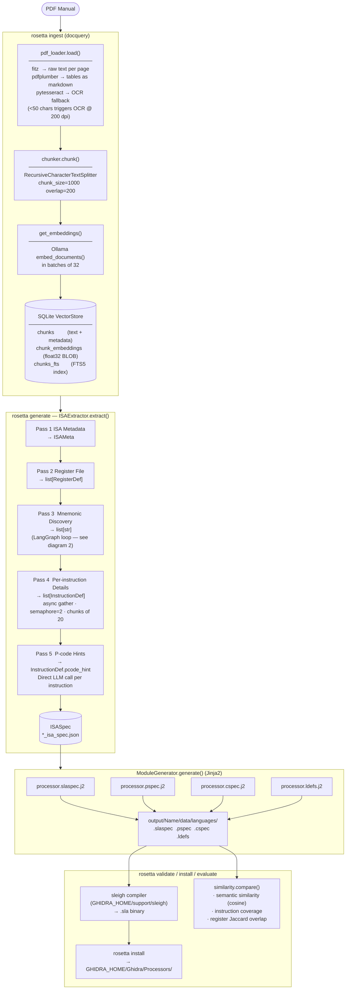
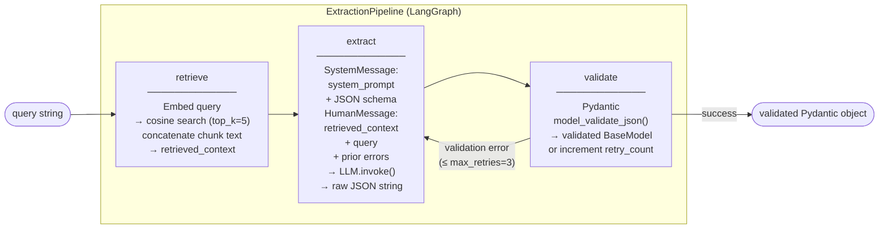
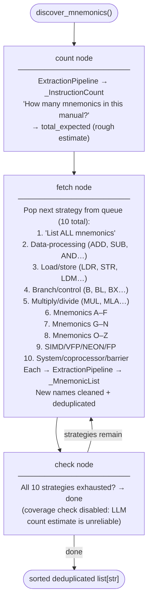
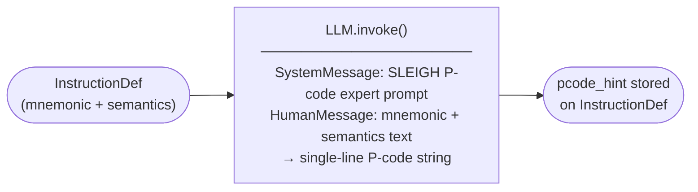

# Rosetta Data Flow

Two diagrams: the overall pipeline end-to-end, then a zoom-in on the extraction passes.

---

## 1. Full Pipeline

---

## 2. Extraction Pipeline Internals

Each of passes 1, 2, and 4 runs an **ExtractionPipeline** (a three-node LangGraph).
Pass 3 (mnemonic discovery) runs a separate **multi-strategy LangGraph loop** that calls ExtractionPipeline internally.
Pass 5 calls the LLM directly with no RAG retrieval.

### ExtractionPipeline (one call, used by passes 1, 2, 4)

### Pass 3 — Mnemonic Discovery (LangGraph)

### Pass 5 — P-code Generation (direct LLM)

---

## Data Shapes

| Stage | Input | Output |
|---|---|---|
| `pdf_loader.load()` | `.pdf` file | `list[Document]` — one per page |
| `chunker.chunk()` | `list[Document]` | `list[Document]` — overlapping text chunks |
| `get_embeddings().embed_documents()` | `list[str]` | `list[list[float]]` (dim = model-dependent) |
| `VectorStore.add_chunks()` | chunks + embeddings | SQLite rows: `chunks`, `chunk_embeddings`, `chunks_fts` |
| `VectorStore.similarity_search()` | query vector | top-k `dict` rows by cosine distance |
| `ExtractionPipeline.run()` | query string | validated Pydantic `BaseModel` |
| `ISAExtractor.extract()` | db path | `ISASpec` (meta + registers + instructions) |
| `ModuleGenerator.generate()` | `ISASpec` + name | `.slaspec`, `.pspec`, `.cspec`, `.ldefs` |

---

## Key Configuration (`.env`)

| Variable | Controls |
|---|---|
| `EMBED_PROVIDER` / `EMBED_MODEL` / `EMBED_BASE_URL` | Embedding model for ingest + retrieval |
| `LLM_PROVIDER` / `LLM_MODEL` / `LLM_API_KEY` | LLM for all five extraction passes |
| `CHUNK_SIZE` / `CHUNK_OVERLAP` | Text splitter parameters (default 1000/200) |
| `TOP_K` | Number of chunks returned per RAG query (default 5) |
| `MAX_RETRIES` | LangGraph retry budget per ExtractionPipeline call (default 3) |
| `TEMPERATURE` | LLM sampling temperature (default 0) |
| `GHIDRA_HOME` / `JAVA_HOME` | Required for validate, install, load-test |
