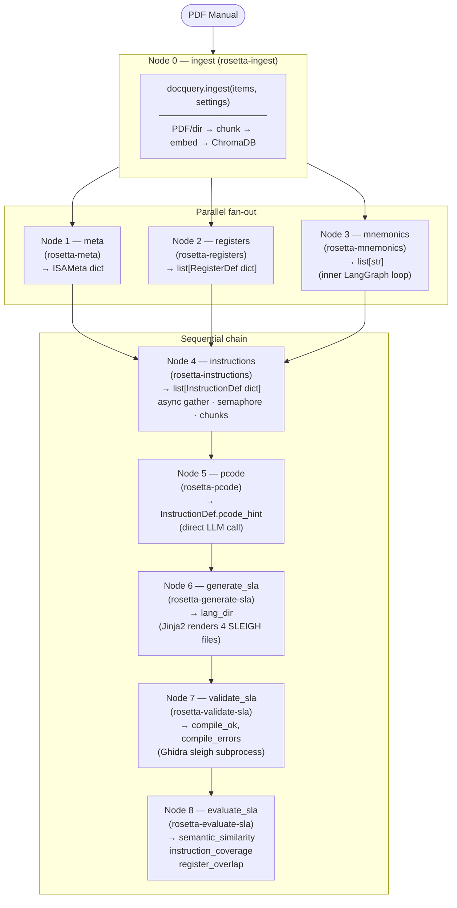
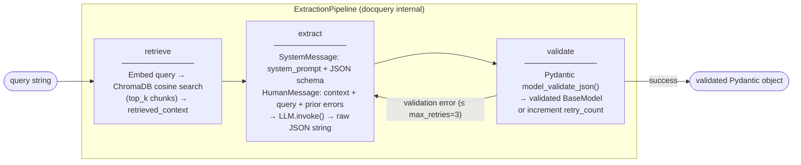
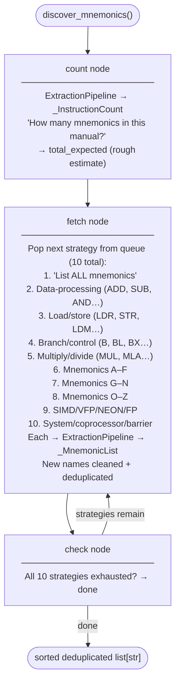
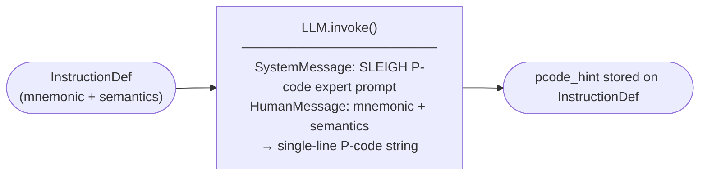

# Rosetta Data Flow

Two diagrams: the overall pipeline end-to-end, then a zoom-in on extraction internals.

---

## 1. Full Pipeline (LangGraph StateGraph)

The pipeline is a compiled `StateGraph[PipelineState]` wired in `src/rosetta/graph.py`.
After ingestion, **meta / registers / mnemonics** run in parallel; LangGraph waits for all
three before firing `instructions` (standard fan-in barrier, no key conflicts).



### PipelineState keys written by each node

| Node | Reads | Writes |
|------|-------|--------|
| `ingest` | `db_path`, `settings_dict`, `source_path` | `errors` |
| `meta` | `db_path`, `settings_dict` | `meta`, `errors` |
| `registers` | `db_path`, `settings_dict` | `registers`, `errors` |
| `mnemonics` | `db_path`, `settings_dict`, `filter_mnemonics` | `mnemonics`, `errors` |
| `instructions` | `mnemonics`, `db_path`, `settings_dict`, `max_concurrent`, `max_instructions`, `chunk_size`, `memory_warn_gb`, `inter_chunk_sleep`, `resume`, `debug_save_dir`, `stop_after` | `instructions`, `errors` |
| `pcode` | `instructions`, `settings_dict`, `max_pcode` | `instructions` (updated), `errors` |
| `generate_sla` | `meta`, `registers`, `instructions`, `processor_name`, `out_dir` | `lang_dir`, `errors` |
| `validate_sla` | `lang_dir`, `ghidra_home` | `compile_ok`, `compile_errors`, `errors` |
| `evaluate_sla` | `lang_dir`, `reference_slaspec`, `settings_dict` | `semantic_similarity`, `instruction_coverage`, `register_overlap`, `errors` |

`errors` is accumulated — each node appends to the list from prior nodes.

---

## 2. Extraction Internals

### Nodes 1, 2, 4 — ExtractionPipeline (docquery)

Each of meta, registers, and individual instruction extractions calls:

```python
docquery.query(prompt, schema=Model, system_prompt=..., settings=settings)
# internally: _build_chroma(settings) → ExtractionPipeline.run(prompt)
```

`ExtractionPipeline` is a three-node LangGraph:



### Node 3 — Mnemonic Discovery (inner LangGraph)

`discover_mnemonics()` in `rosetta-mnemonics` runs its own `StateGraph[_MnemonicState]`:



### Node 5 — P-code Hints (direct LLM, no RAG)



---

## 3. Package Layout

```
rosetta/                         (uv workspace root)
├── packages/
│   ├── rosetta-schemas/         PipelineState, ISAMeta, RegisterDef, InstructionDef, ISASpec
│   ├── rosetta-utils/           llm.py, memory_guard.py
│   ├── rosetta-ingest/          Node 0: docquery.ingest()
│   ├── rosetta-meta/            Node 1: docquery.query() → ISAMeta
│   ├── rosetta-registers/       Node 2: docquery.query() → list[RegisterDef]
│   ├── rosetta-mnemonics/       Node 3: inner LangGraph multi-strategy loop
│   ├── rosetta-instructions/    Node 4: async per-instruction extraction
│   ├── rosetta-pcode/           Node 5: direct LLM P-code generation
│   ├── rosetta-generate-sla/    Node 6: Jinja2 → .slaspec/.pspec/.cspec/.ldefs
│   ├── rosetta-validate-sla/    Node 7: Ghidra sleigh subprocess
│   └── rosetta-evaluate-sla/    Node 8: cosine similarity + coverage metrics
└── src/rosetta/
    ├── graph.py                 build_graph() / build_compiled_graph()
    ├── cli.py                   CLI entry-points (ingest, generate, validate, …)
    └── extraction/
        └── isa_extractor.py     Legacy ISAExtractor (thin wrapper, still usable)
```

---

## 4. Data Shapes

| Stage | Input | Output |
|---|---|---|
| `docquery.ingest()` | `.pdf` path or directory | ChromaDB collection populated |
| `docquery.query()` | prompt + Pydantic schema | validated `BaseModel` instance |
| `ISAExtractor.extract()` | db path (legacy path) | `ISASpec` (meta + registers + instructions) |
| `ModuleGenerator.generate()` | `ISASpec` + processor name | `.slaspec`, `.pspec`, `.cspec`, `.ldefs` |
| `compile_slaspec()` | `.slaspec` path + Ghidra home | `SleighResult(returncode, errors)` |
| `similarity.compare()` | two `.slaspec` texts | `SimilarityReport(semantic_similarity, instruction_coverage, register_overlap)` |

---

## 5. Key Configuration (`.env`)

| Variable | Controls |
|---|---|
| `EMBED_PROVIDER` / `EMBED_MODEL` / `EMBED_BASE_URL` | Embedding model for ingest + retrieval |
| `LLM_PROVIDER` / `LLM_MODEL` / `LLM_API_KEY` | LLM for all extraction passes |
| `CHUNK_SIZE` / `CHUNK_OVERLAP` | Text splitter parameters (default 1000/200) |
| `TOP_K` | Chunks returned per RAG query (default 5) |
| `MAX_RETRIES` | Retry budget per ExtractionPipeline call (default 3) |
| `TEMPERATURE` | LLM sampling temperature (default 0) |
| `GHIDRA_HOME` / `JAVA_HOME` | Required for validate, install, load-test |
